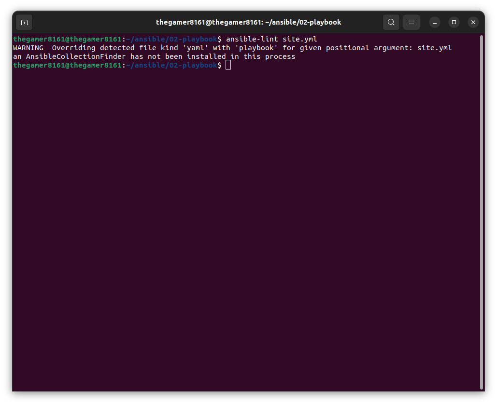
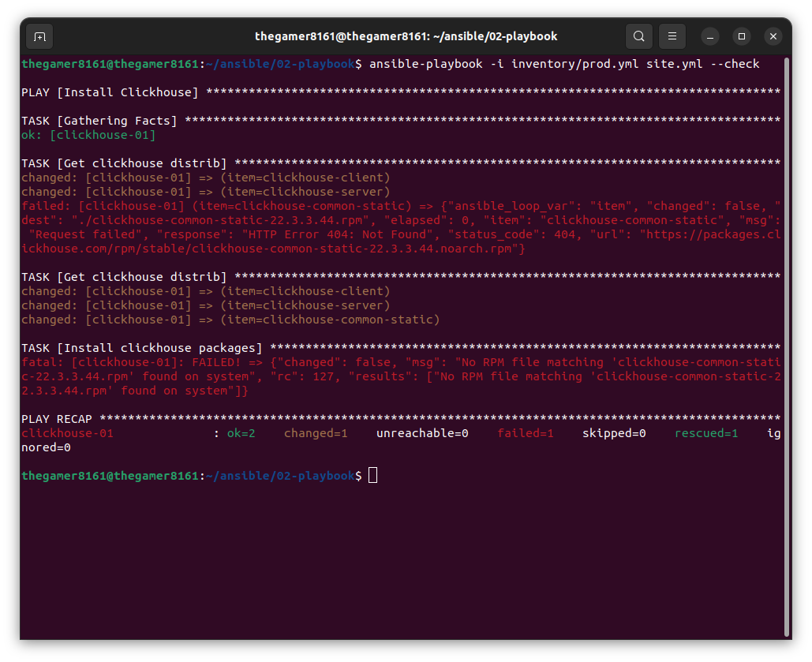
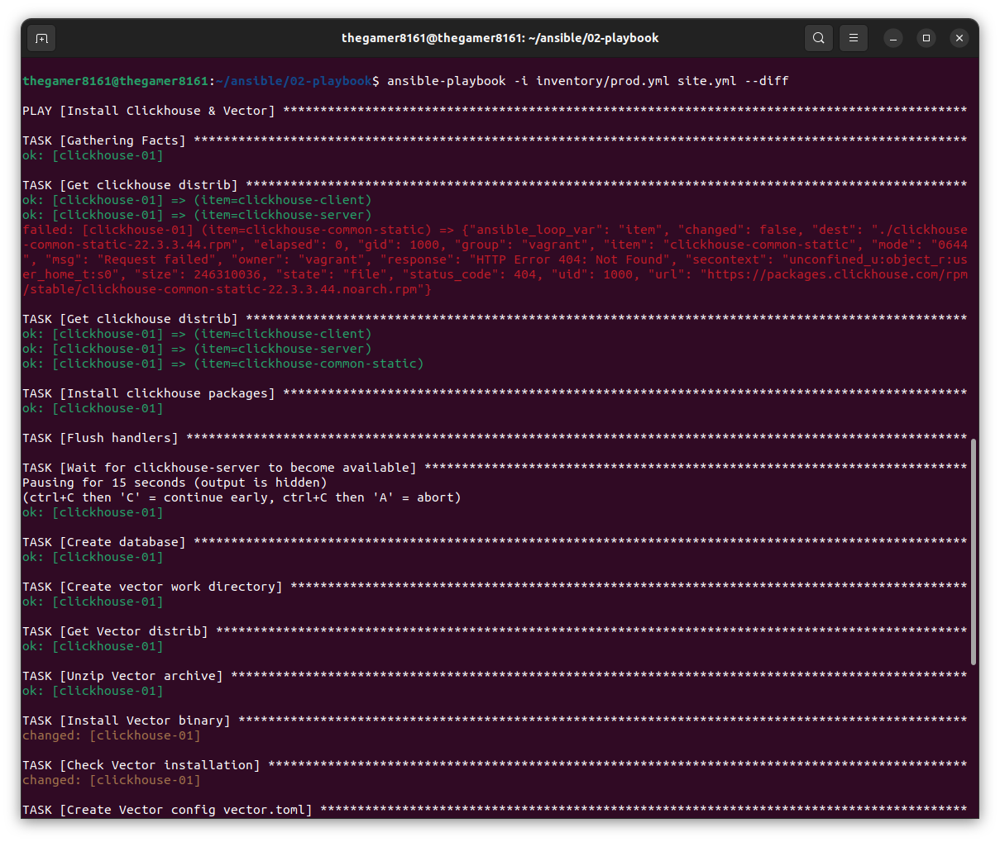
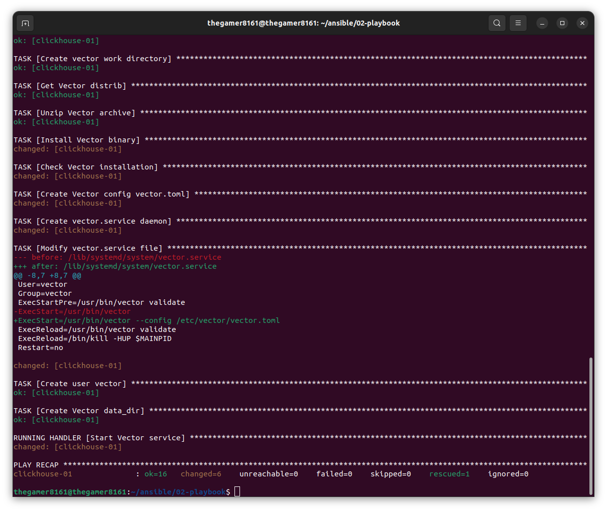
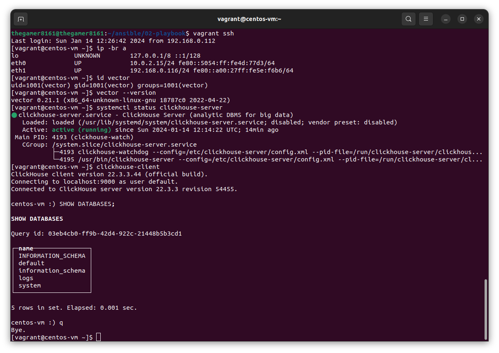

# Никоноров Денис - FOPS-8
# Домашнее задание к занятию 2 «Работа с Playbook»

---

## Основная часть

#### 1. Подготовить свой inventory-файл `prod.yml`.

[prod.yml](inventory/prod.yml)

#### 2. Допишите playbook: нужно сделать ещё один play, который устанавливает и настраивает vector. Конфигурация vector должна деплоиться через template файл jinja2. От вас не требуется использовать все возможности шаблонизатора, просто вставьте стандартный конфиг в template файл. Информация по шаблонам по ссылке. не забудьте сделать handler на перезапуск vector в случае изменения конфигурации!

В [site.yml](site.yml) добавлен блок task с ```tags: vector```

#### 3. При создании tasks рекомендую использовать модули: get_url, template, unarchive, file.

Были использованы следующие модули:
1. ```ansible.builtin.get_url```
2. ```ansible.builtin.yum```
3. ```ansible.builtin.meta```
4. ```ansible.builtin.pause```
5. ```ansible.builtin.command```
6. ```ansible.builtin.file```
7. ```ansible.builtin.unarchive```
8. ```ansible.builtin.copy```
9. ```ansible.builtin.replace```
10. ```ansible.builtin.user```
11. ```ansible.builtin.service```
12. ```ansible.builtin.systemd```

#### 4. Task должны: скачать дистрибутив нужной версии, выполнить распаковку в выбранную директорию и установить vector.

task представлены в [site.yml](site.yml)

#### 5. Запустите ansible-lint site.yml и исправьте ошибки, если они есть.



В моем случае ошибок нет

#### 6. Попробуйте запустить playbook на этом окружении с флагом `--check`.



В результате  проверка останавливается на этапе установки пакетов Clickhouse, т.к они не скачены в систему

#### 7. Запустите playbook на `prod.yml` окружении с флагом `--diff`. Убедитесь, что изменения на системе произведены.





Проверка изменений на хосте (192.168.0.116)



#### 8. Повторно запустите playbook с флагом `--diff` и убедитесь, что playbook идемпотентен.

```
thegamer8161@thegamer8161:~/ansible/02-playbook$ ansible-playbook -i inventory/prod.yml site.yml --diff

PLAY [Install Clickhouse & Vector] ********************************************************************************************

TASK [Gathering Facts] ********************************************************************************************************
ok: [clickhouse-01]

TASK [Get clickhouse distrib] *************************************************************************************************
ok: [clickhouse-01] => (item=clickhouse-client)
ok: [clickhouse-01] => (item=clickhouse-server)
failed: [clickhouse-01] (item=clickhouse-common-static) => {"ansible_loop_var": "item", "changed": false, "dest": "./clickhouse-common-static-22.3.3.44.rpm", "elapsed": 0, "gid": 1000, "group": "vagrant", "item": "clickhouse-common-static", "mode": "0644", "msg": "Request failed", "owner": "vagrant", "response": "HTTP Error 404: Not Found", "secontext": "unconfined_u:object_r:user_home_t:s0", "size": 246310036, "state": "file", "status_code": 404, "uid": 1000, "url": "https://packages.clickhouse.com/rpm/stable/clickhouse-common-static-22.3.3.44.noarch.rpm"}

TASK [Get clickhouse distrib] *************************************************************************************************
ok: [clickhouse-01] => (item=clickhouse-client)
ok: [clickhouse-01] => (item=clickhouse-server)
ok: [clickhouse-01] => (item=clickhouse-common-static)

TASK [Install clickhouse packages] ********************************************************************************************
ok: [clickhouse-01]

TASK [Flush handlers] *********************************************************************************************************

TASK [Wait for clickhouse-server to become available] *************************************************************************
Pausing for 15 seconds (output is hidden)
(ctrl+C then 'C' = continue early, ctrl+C then 'A' = abort)
ok: [clickhouse-01]

TASK [Create database] ********************************************************************************************************
ok: [clickhouse-01]

TASK [Create vector work directory] *******************************************************************************************
ok: [clickhouse-01]

TASK [Get Vector distrib] *****************************************************************************************************
ok: [clickhouse-01]

TASK [Unzip Vector archive] ***************************************************************************************************
ok: [clickhouse-01]

TASK [Install Vector binary] **************************************************************************************************
ok: [clickhouse-01]

TASK [Check Vector installation] **********************************************************************************************
changed: [clickhouse-01]

TASK [Create Vector config vector.toml] ***************************************************************************************
ok: [clickhouse-01]

TASK [Create vector.service daemon] *******************************************************************************************
changed: [clickhouse-01]

TASK [Modify vector.service file] *********************************************************************************************
--- before: /lib/systemd/system/vector.service
+++ after: /lib/systemd/system/vector.service
@@ -8,7 +8,7 @@
 User=vector
 Group=vector
 ExecStartPre=/usr/bin/vector validate
-ExecStart=/usr/bin/vector
+ExecStart=/usr/bin/vector --config /etc/vector/vector.toml
 ExecReload=/usr/bin/vector validate
 ExecReload=/bin/kill -HUP $MAINPID
 Restart=no

changed: [clickhouse-01]

TASK [Create user vector] *****************************************************************************************************
ok: [clickhouse-01]

TASK [Create Vector data_dir] *************************************************************************************************
ok: [clickhouse-01]

RUNNING HANDLER [Start Vector service] ****************************************************************************************
changed: [clickhouse-01]

PLAY RECAP ********************************************************************************************************************
clickhouse-01              : ok=16   changed=4    unreachable=0    failed=0    skipped=0    rescued=1    ignored=0
```

#### 9. Подготовьте README.md-файл по своему playbook. В нём должно быть описано: что делает playbook, какие у него есть параметры и теги. Пример качественной документации ansible playbook по [ссылке](https://github.com/opensearch-project/ansible-playbook).

[site.yml](site.yml) содержит 2 блока:
#### 1. Первый блок объединяет последовательность задач по инсталяции Clickhouse. Блоку соответствует ```tags: clickhouse```. В блоке используются параметры:
- ```clickhouse_version: "22.3.3.44"``` - версия Clickhouse
- ```clickhouse_packages: ["clickhouse-client", "clickhouse-server", "clickhouse-common-static"]``` - список пакетов для установки

Task'и:
- ```TASK [Clickhouse. Get clickhouse distrib]``` - скачивает rpm-пакеты с дистрибутивами с помощью модуля ```ansible.builtin.get_url```
- ```TASK [Clickhouse. Install clickhouse packages]``` - устанавливает набор пакетов с помощью модуля ```ansible.builtin.yum```
- ```TASK [Clickhouse. Flush handlers]``` - инициирует внеочередной запуск хандлера ```Start clickhouse service```
- ```RUNNING HANDLER [Start clickhouse service]``` - для старта сервера ```clickhouse``` в хандлере используется модуль ```ansible.builtin.service```
- ```TASK [Clickhouse. Wait for clickhouse-server to become available]``` - устанавливает паузу в 15 секунд с помощью модуля ```ansible.builtin.pause```, чтобы сервер Clickhouse успел запуститься. Иначе следующая задача по созданию БД может завершиться ошибкой, т.к. сервер еще не успел подняться
- ```TASK [Clickhouse. Create database]``` - создает инстанс базы данных Clickhouse

#### 2. Второй блок объединяет последовательность задач по инсталяции Vector. Блоку соответствует ```tags: vector```. В блоке используются параметры:
- ```vector_version: "0.21.1"``` - версия Vector
- ```vector_os_arh: "x86_64"``` - архитектура ОС
- ```vector_workdir: "/home/centos/vector"``` - рабочий каталог, в котором будут сохранены скачанные rpm-пакеты
- ```vector_os_user: "vector"``` - имя пользователя-владельца Vector в ОС
- ```vector_os_group: "vector"``` - имя группы пользователя-владельца Vector в ОС

Task'и:
- ```TASK [Vector. Create work directory]``` - создает рабочий каталог, в котором будут сохранены скачанные rpm-пакеты, с помощью модуля ```ansible.builtin.file```
- ```TASK [Vector. Get Vector distributive]``` - скачивает архив с дистрибутивом с помощью модуля ```ansible.builtin.get_url```
- ```TASK [Vector. Unzip archive]``` - распаковывает скачанный архив с помощью модуля ```ansible.builtin.unarchive```
- ```TASK [Vector. Install vector binary file]``` - копирует исполняемый файл Vector в ```/usr/bin``` с помощью модуля ```ansible.builtin.copy```
- ```TASK [Vector. Check Vector installation]``` - проверяет, что бинарный файл Vector работает корректно, с помощью модуля ```ansible.builtin.command```
- ```TASK [Vector. Create Vector config vector.toml]``` - создает файл ```/etc/vector/vector.toml``` с конфигом Vector с помощью модуля ```ansible.builtin.copy```
- ```TASK [Vector. Create vector.service daemon]``` - создает файл юнита systemd ```/lib/systemd/system/vector.service``` с помощью модуля ```ansible.builtin.copy```
- ```TASK [Vector. Modify vector.service file]``` - редактирует файл юнита systemd ```/lib/systemd/system/vector.service``` с помощью модуля ```ansible.builtin.replace```
- ```TASK [Vector. Create user vector]``` - создает пользователя ОС с помощью модуля ```ansible.builtin.user```
- ```TASK [Vector. Create data_dir]``` - создает каталог для данных Vector с помощью модуля ```ansible.builtin.file```
- ```RUNNING HANDLER [Start Vector service]``` - инициируется запуск хандлера ```Start Vector service```, обновляющего конфигурацию systemd и стартующего сервис ```vector.service``` с помощью модуля ```ansible.builtin.systemd```

#### 3. Есть Vagrantfile для создания VM Centos 

```config.vm.hostname = "centos-vm"``` присваивает VM hostname

```config.vm.box = "centos/7"``` используемый образ OS

```config.vm.network "public_network", bridge: "wlp2s0"``` настройка сети

```
config.vm.provision "shell", inline: <<-SHELL
    ip a
  SHELL
``` когда ВМ запустится в консоль будет выведен IP VM